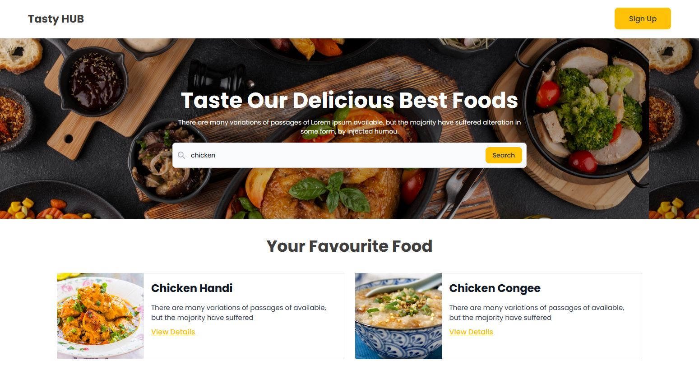

<h3>Meal Resource And Cooking Details</h3>
<h4>Made By:</h4>
<ul type="square" style="display:flex; gap:5px;">
  <li>HTML5</li>
  <li>CSS3</li>
  <li>Tailwind css</li>
  <li>Javascript</li>
  <li>JSON API</li>
</ul>
<b>Live Link: <a href="https://mdaminul1024.github.io/mealdb-resources-main/">Live Link</a><b>

 

